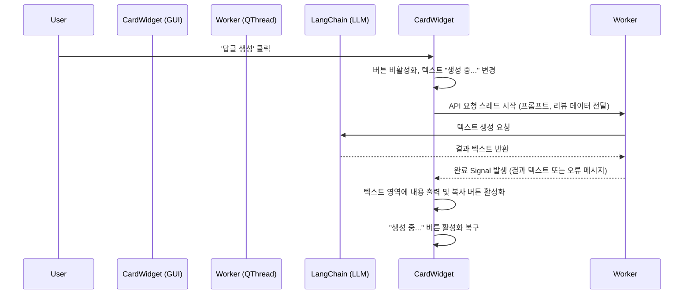

# 기술 명세서 (Technical Specification)

본 문서는 '네이버 스마트스토어 리뷰 AI 답글 생성기'의 소프트웨어 아키텍처, 기술 스택, 데이터 흐름 및 핵심 모듈의 구현 전략을 정의합니다.

## 1. 시스템 아키텍처 개요

본 프로젝트는 순수 로컬 데스크톱 애플리케이션으로, 백엔드 서버 없이 직접 외부 API(LangChain 연동)와 통신합니다. 애플리케이션은 논리적으로 3개의 계층으로 분리하여 구현합니다.

- **Presentation Layer (GUI)**: PySide6 기반의 사용자 인터페이스. UI 컴포넌트(메인 윈도우, 카드 위젯 등) 및 이벤트 핸들러 배치.
- **Business Logic Layer**: CSV/Excel 파싱, 데이터 가공, LangChain 기반 LLM 통신 로직 및 스레드(비동기) 관리.
- **Data & Config Layer**: 사용자 설정(`config.json`) 읽기/쓰기 및 로컬 시스템 파일 I/O 담당.

## 2. 기술 스택 및 라이브러리

- **Python 버젼**: Python 3.9 이상 권장
- **GUI 프레임워크**: `PySide6` (Qt6를 기반으로 세련된 데스크톱 UI 구성 및 비동기 처리에 용이함)
- **데이터 파싱**: `pandas`, `openpyxl` (다양한 포맷의 엑셀/CSV 데이터 안정적 처리)
- **AI 프레임워크**: `langchain`, `langchain-openai` (LLM 오케스트레이션 및 OpenAI 연동)
- **빌드 및 패키징**: `PyInstaller` (단일 실행 파일 생성)

## 3. 데이터 모델 및 파싱 명세

### 3.1. 파일 구조 (입력 데이터)

사용자가 업로드하는 파일(CSV 또는 엑셀)은 반드시 다음 4개의 논리적 컬럼을 포함해야 합니다. (헤더 이름은 유연하게 처리하거나 엄격히 지정할 수 있음)

| 상품명 (Product Name) | 고객명 (Customer Name) | 별점 (Rating) | 리뷰 내용 (Review Content) |
| :--- | :--- | :--- | :--- |
| 에어팟 프로 케이스 | 김땡땡 | 5 | 배송이 빠르고 상품이 너무 예뻐요! |


### 3.2. 내부 데이터 클래스 (Data Class)

파싱된 데이터는 GUI 위젯으로 전달하기 전에 아래와 같은 불변 데이터 객체로 매핑됩니다.

```python
from dataclasses import dataclass

@dataclass(frozen=True)
class ReviewData:
    product_name: str
    customer_name: str
    rating: int      # 1~5 정수형 권장
    content: str
```

#### 구현

- **`replyreview/models.py`**: `ReviewData` frozen dataclass 정의. GUI와 파서 계층 모두에서 참조하는 공유 도메인 모델입니다.
- **`replyreview/parser/review_parser.py`**: `ReviewParser` 클래스와 `ParserError` 예외. 파일을 읽어 `ReviewData` 리스트로 변환합니다.
- **`replyreview/parser/README.md`**: parser 모듈 명세 및 사용 가이드

## 4. 핵심 구현 전략

### 4.1. 비동기 통신 처리 (QThread 기반)

PySide6 GUI 스레드에서 외부 API 통신과 같은 I/O 바운드 작업을 직접 수행하면 화면이 멈추는 프리징(Freezing) 현상이 발생합니다. 이를 방지하기 위해 PySide의 `QThread`와 시그널/슬롯(Signals and Slots) 메커니즘을 사용합니다.



### 4.2. AI 클라이언트 추상화 및 테스트 전략

외부 AI 서비스(OpenAI)와의 의존성을 분리하고 테스트 용이성을 확보하기 위해, **Abstract Base Class(ABC)**를 기반으로 클라이언트를 추상화합니다.

-   **Interface (`AIClient` ABC)**: 답글 생성을 위한 추상 메서드 `generate_reply`를 정의합니다.
-   **Implementation (`OpenAIClient`)**: 실제 LangChain과 OpenAI API를 사용하여 답글을 생성합니다.
-   **Fake Client (`FakeAIClient`)**: 테스트 코드에서 사용하며, 네트워크 호출 없이 미리 정의된 가짜(Fake) 응답을 즉시 반환합니다.

### 4.3. LangChain 프롬프트 엔지니어링

- **System Message**: "당신은 친절하고 전문적인 쇼핑몰 고객센터 직원입니다. 고객의 리뷰에 공감하며 예의 바르게 답변해야 합니다. **모든 답변은 반드시 한국어로만 작성하십시오.**"
- **Human Message Template**: 
  ```text
  고객명: {customer_name}
  구매상품: {product_name}
  별점: {rating}/5
  리뷰 내용: {content}
  
  위 리뷰에 대한 적절한 답글을 작성해 주세요.
  ```

### 4.3. 설정 관리 (`config.json`)

OpenAI API 키 저장을 위해 프로젝트 루트(실행 파일 경로 기준)에 `config.json`을 생성 및 관리합니다. LangChain의 `ChatOpenAI` 객체 생성 시 이 키를 주입합니다.

```json
{
  "openai_api_key": "sk-..."
}
```

#### 구현

- **`replyreview/config/config_manager.py`**: `ConfigManager` 클래스는 `config.json` 읽기/쓰기를 전담합니다.
  - 파일 부재 또는 JSON 파싱 오류 시 기본값(`{"openai_api_key": ""}`)으로 자동 복구
  - `load()`, `save()`, `get_api_key()`, `set_api_key()` 메서드 제공
- **`replyreview/config/README.md`**: config 모듈 명세 및 사용 가이드

#### 특징

- 파이썬 내장 `json` 모듈을 사용하여 읽기/쓰기를 수행합니다.
- 예외 처리: 파일이 존재하지 않거나 형식이 깨진 경우 기본값을 세팅하여 새로 생성합니다.
- 다른 모듈은 `ConfigManager`를 통해서만 설정에 접근하며, 파일 경로나 JSON 포맷을 직접 다루지 않습니다.

### 4.4. 클립보드 제어

PySide6의 `QApplication.clipboard()` 객체를 활용하여 데스크톱 시스템 클립보드에 접근합니다.

```python
clipboard = QApplication.clipboard()
clipboard.setText(generated_reply_text)
```

## 5. 빌드 및 배포 전략 (PyInstaller)

- 앱 외주 결과물(포트폴리오) 성격에 맞게, 코드를 모르는 사용자도 바로 실행할 수 있도록 단일 디렉토리 또는 단일 실행 파일 형태로 빌드합니다.
- 콘솔 윈도우가 뜨지 않도록 `--windowed` 또는 `--noconsole` 옵션을 필수로 적용합니다.
- `pandas` 등 용량이 큰 라이브러리가 포함되므로 빌드 최적화가 필요할 수 있습니다. (불필요한 모듈 제외)

