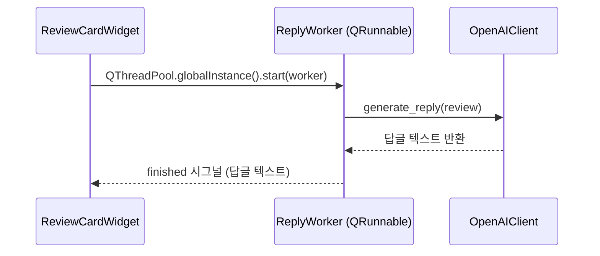

# `ai` Module

## 1. 모듈 개요

`ai` 모듈은 **Business Logic Layer**로서 외부 AI 서비스(OpenAI)와의 의존성을 추상화하고, GUI 프리징 없이 답글을 생성하는 비동기 인프라를 제공합니다. 핵심 설계 원칙:

- **의존성 역전**: `AIClient` ABC를 통해 실제 OpenAI 구현체와 테스트용 Fake 구현체를 동일한 인터페이스로 교체 가능
- **비동기 처리**: `QRunnable` 기반 워커로 AI API 호출을 백그라운드 스레드에서 실행하여 메인 GUI 스레드 블로킹 방지
- **오류 분류**: OpenAI 인증 실패(`AIAuthError`)와 일반 네트워크 오류를 구분하여 UI에서 맥락에 맞는 피드백 제공

## 2. 관련 문서

- `docs/tech-spec.md` - 4.4절: AI 클라이언트 추상화 및 비동기 처리
- `replyreview/gui/README.md` - GUI에서 AIClient 사용 방식

## 3. 의존성

- **`langchain-openai`**: `ChatOpenAI` LLM 래퍼
- **`langchain-core`**: `ChatPromptTemplate`, `StrOutputParser`
- **`openai`**: `AuthenticationError` 감지용
- **`pydantic`**: `SecretStr` (API 키 타입 안전성)
- **`PySide6`**: `QRunnable`, `QObject`, `Signal` (비동기 워커)
- **`replyreview.models.ReviewData`**: 도메인 모델

## 4. 핵심 컴포넌트

### AIClient (ABC)

`AIClient`는 답글 생성 인터페이스를 정의하는 추상 기반 클래스입니다. (`replyreview/ai/client.py`)

- 실제 OpenAI 구현체와 테스트용 Fake 구현체를 동일한 인터페이스로 교체할 수 있도록 의존성을 역전시킵니다.
- 구현체는 `generate_reply` 메서드를 재정의하여 답글 생성 로직을 제공하며, 인증 실패 시 `AIAuthError`를 raise해야 합니다.

### AIAuthError

OpenAI API 키 인증 실패를 나타내는 커스텀 예외입니다. (`replyreview/ai/client.py`)

- 일반 네트워크 오류(`Exception`)와 인증 오류를 명확히 구분하기 위해 사용합니다.
- `WorkerSignals.auth_error` 시그널을 통해 GUI로 전달되어 사용자에게 구체적인 오류 피드백을 제공합니다.

### FakeAiClient

테스트 환경에서 과금 및 네트워크 의존성 없이 AI 응답을 시뮬레이션하는 Fake `AIClient` 구현체입니다. (`replyreview/ai/fake_client.py`)

- **목표**: 외부 API 호출 비용을 절감하고, 테스트 실행 속도를 극대화하며, 네트워크 환경에 구애받지 않는 결정론적(Deterministic) 테스트 환경을 구축합니다.
- **동작 원리**: 실제 OpenAI 서버와 통신하는 대신, 미리 정의된 고정 텍스트(`REPLY_TEMPLATE`)를 즉시 반환합니다.
- **예외 시뮬레이션**: `raise_error` 파라미터를 통해 인증 실패(`AIAuthError`)나 네트워크 장애 등 다양한 오류 시나리오를 인위적으로 발생시켜 시스템의 예외 처리 로직을 검증할 수 있습니다.

### OpenAIClient

LangChain `ChatOpenAI`를 사용하는 실제 `AIClient` 구현체입니다. (`replyreview/ai/openai_client.py`)

- API 키를 주입받아 `ChatPromptTemplate` + `ChatOpenAI` + `StrOutputParser` 체인을 구성하고, `generate_reply` 호출 시 LangChain 체인을 실행하여 답글 텍스트를 반환합니다.
- `openai.AuthenticationError` 발생 시 `AIAuthError`로 변환하여 상위 계층에서 일관되게 처리할 수 있도록 합니다.
- 프롬프트는 `docs/tech-spec.md` 4.3절의 System Message / Human Message 템플릿을 따릅니다.

### WorkerSignals / ReplyWorker

GUI 프리징 없이 AI 응답을 기다리기 위한 비동기 워커입니다. (`replyreview/ai/worker.py`)

- **`WorkerSignals`**: AI 작업 결과를 GUI로 전달하는 Qt 시그널 컨테이너입니다. 답글 생성 성공 시 `finished`, 인증 실패 시 `auth_error`, 그 외 예외 발생 시 `error` 시그널을 발행합니다.
- **`ReplyWorker`**: `QRunnable`을 상속하여 `QThreadPool`에 제출되고 백그라운드 스레드에서 실행됩니다. `AIClient`와 `ReviewData`를 주입받아 메인 GUI 스레드를 블로킹하지 않고 답글을 생성하며, 결과를 `WorkerSignals`를 통해 위젯에 전달합니다.

## 5. 비동기 흐름

## 6. 테스트

### 6.1. 테스트 파일

- **tests/ai/test_fake_client.py**: `FakeAIClient`가 설정된 시나리오(정상 응답, 오류 발생 등)에 따라 의도한 대로 동작하는지 검증하는 단위 테스트입니다.
- **tests/ai/test_openai_client.py**: 실제 OpenAI API 서버와 통신하여 `OpenAIClient`의 통합 동작을 확인하는 수동 테스트입니다. API 호출 비용 및 보안을 위해 별도의 환경 변수 설정이 필요합니다.
  - 실행 방법: `OPENAI_API_KEY=sk-... uv run pytest tests/ai/test_openai_client.py`

### 6.2. 테스트 전략

- **Mocking 객체 활용**: 외부 OpenAI API에 의존하지 않도록 `FakeAIClient`를 활용합니다. 이를 통해 네트워크 지연이나 과금 발생 없이 빠르고 결정론적인(Deterministic) 단위 테스트 환경을 보장합니다.
- **수동 1회성 통합 테스트 설계**: 실제 API를 호출하는 `OpenAIClient` 테스트는 과금 및 자동화 파이프라인(CI/CD) 지연을 방지하기 위해 `pytest.mark.skip` 처리했으며, 필요 시에만 `OPENAI_API_KEY` 환경 변수를 주입하여 수동으로 실행합니다.
- **의존성 주입 및 Fixture 활용**: `pytest`의 `@pytest.fixture`를 적극 활용하여 테스트용 도메인 모델(`ReviewData`)과 `FakeAIClient` 인스턴스를 각 테스트 메서드에 주입하여 코드 중복을 줄이고 테스트 간 격리를 유지합니다.

