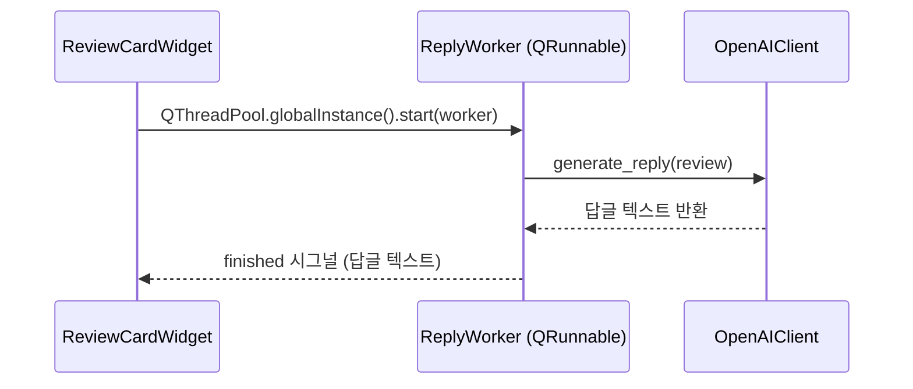

# AI Module

## 모듈 역할

`ai` 모듈은 **Business Logic Layer**로서 외부 AI 서비스(OpenAI)와의 의존성을 추상화하고, GUI 프리징 없이 답글을 생성하는 비동기 인프라를 제공합니다. 핵심 설계 원칙:

- **의존성 역전**: `AIClient` ABC를 통해 실제 OpenAI 구현체와 테스트용 Fake 구현체를 동일한 인터페이스로 교체 가능
- **비동기 처리**: `QRunnable` 기반 워커로 AI API 호출을 백그라운드 스레드에서 실행하여 메인 GUI 스레드 블로킹 방지
- **오류 분류**: OpenAI 인증 실패(`AIAuthError`)와 일반 네트워크 오류를 구분하여 UI에서 맥락에 맞는 피드백 제공

## 핵심 컴포넌트

### AIClient (ABC)

`AIClient`는 답글 생성 인터페이스를 정의하는 추상 기반 클래스입니다. (`replyreview/ai/client.py`)

#### 추상 메서드

```python
@abstractmethod
def generate_reply(self, review: ReviewData) -> str:
    """리뷰 데이터를 받아 생성된 답글 텍스트를 반환한다."""
```

- 구현체는 이 메서드를 재정의하여 실제 답글 생성 로직을 제공합니다.
- 인증 실패 시 `AIAuthError`를 raise해야 합니다.

### AIAuthError

OpenAI API 키 인증 실패를 나타내는 커스텀 예외입니다. (`replyreview/ai/client.py`)

- 일반 네트워크 오류(`Exception`)와 구별하기 위해 사용합니다.
- `WorkerSignals.auth_error` 시그널을 통해 GUI로 전달되어 구체적인 오류 메시지를 표시합니다.

```python
from replyreview.ai.client import AIAuthError

raise AIAuthError("인증 실패 메시지")
```

### OpenAIClient

LangChain `ChatOpenAI`를 사용하는 실제 답글 생성 구현체입니다. (`replyreview/ai/openai_client.py`)

#### 생성자

```python
def __init__(self, api_key: str) -> None:
```

- `api_key`를 주입받아 `ChatPromptTemplate` + `ChatOpenAI` + `StrOutputParser` 체인을 초기화합니다.
- 프롬프트는 `docs/tech-spec.md` 4.3절의 System Message / Human Message 템플릿을 따릅니다.

#### generate_reply

```python
def generate_reply(self, review: ReviewData) -> str:
```

- LangChain 체인을 호출하여 답글 텍스트를 반환합니다.
- `openai.AuthenticationError` 발생 시 `AIAuthError`로 변환하여 재발생시킵니다.

**사용 예시:**

```python
from replyreview.ai.openai_client import OpenAIClient

client = OpenAIClient(api_key="sk-...")
reply = client.generate_reply(review)
```

### WorkerSignals / ReplyWorker

GUI 프리징 없이 AI 응답을 기다리기 위한 비동기 워커입니다. (`replyreview/ai/worker.py`)

#### WorkerSignals

`QObject`를 상속하는 시그널 컨테이너입니다.

| 시그널 | 파라미터 | 발행 조건 |
|--------|----------|-----------|
| `finished` | `str` (답글 텍스트) | 답글 생성 성공 |
| `auth_error` | 없음 | `AIAuthError` 발생 (API 키 인증 실패) |
| `error` | `str` (오류 메시지) | 그 외 모든 예외 |

#### ReplyWorker

`QRunnable`을 상속하며, `QThreadPool`에 제출되어 백그라운드 스레드에서 실행됩니다.

```python
def __init__(self, client: AIClient, review: ReviewData) -> None:
```

**사용 예시 (`ReviewCardWidget` 내부):**

```python
worker = ReplyWorker(client=self._ai_client, review=self._review)
worker.signals.finished.connect(self._on_reply_finished)
worker.signals.auth_error.connect(self._on_reply_auth_error)
worker.signals.error.connect(self._on_reply_error)
QThreadPool.globalInstance().start(worker)
```

## 비동기 흐름



## 테스트

### FakeAIClient

`tests/fakes.py`에 위치하는 테스트 전용 구현체로, 프로덕션 패키지에 포함되지 않습니다.

- 네트워크 호출 없이 고정 텍스트(`REPLY_TEMPLATE`)를 즉시 반환합니다.
- `raise_error: Exception | None` 옵션으로 오류 시나리오(인증 실패, 네트워크 오류 등)를 시뮬레이션합니다.

```python
from tests.fakes import FakeAIClient
from replyreview.ai.client import AIAuthError

# 정상 동작
client = FakeAIClient()

# 인증 오류 시뮬레이션
client = FakeAIClient(raise_error=AIAuthError("invalid key"))

# 일반 오류 시뮬레이션
client = FakeAIClient(raise_error=RuntimeError("network error"))
```

### 테스트 파일

| 파일 | 실행 방식 | 설명 |
|------|-----------|------|
| `tests/ai/test_fake_client.py` | 자동 (`uv run pytest`) | `FakeAIClient` 동작 검증 |
| `tests/ai/test_openai_client.py` | 수동 (`OPENAI_API_KEY=sk-... uv run pytest tests/ai/test_openai_client.py`) | 실제 OpenAI API 호출 통합 테스트 |
| `tests/gui/test_review_card_widget.py` | 자동 (`uv run pytest`) | 비동기 답글 생성 UI 흐름 검증 |

### 실행

```bash
# 자동 테스트
uv run pytest tests/ai/ -v

# OpenAI 수동 통합 테스트
OPENAI_API_KEY=sk-... uv run pytest tests/ai/test_openai_client.py -v
```

## 의존성

- **`langchain-openai`**: `ChatOpenAI` LLM 래퍼
- **`langchain-core`**: `ChatPromptTemplate`, `StrOutputParser`
- **`openai`**: `AuthenticationError` 감지용
- **`pydantic`**: `SecretStr` (API 키 타입 안전성)
- **`PySide6`**: `QRunnable`, `QObject`, `Signal` (비동기 워커)
- **`replyreview.models.ReviewData`**: 도메인 모델

## 관련 문서

- `docs/tech-spec.md` - 4.4절: AI 클라이언트 추상화 및 비동기 처리
- `replyreview/gui/README.md` - GUI에서 AIClient 사용 방식
- `tests/fakes.py` - 테스트 전용 FakeAIClient
