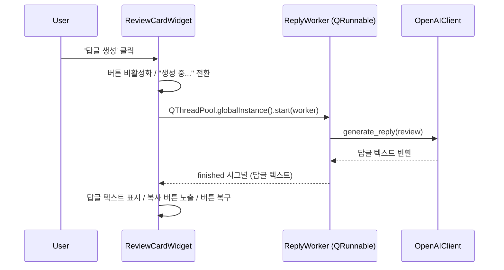

# Specification: AI 답글 생성 엔진 및 비동기 처리 로직 연동

## Overview

이 트랙은 ReplyReview 데스크톱 앱의 핵심 기능인 AI 답글 생성 엔진을 완성합니다. LangChain(OpenAI)을 이용한 `AIClient` 추상화 계층을 구축하고, `QRunnable` 기반의 비동기 워커로 UI 프리징 없이 답글을 생성합니다. 생성된 답글은 리뷰 카드에 표시되며, 원클릭으로 클립보드에 복사할 수 있습니다.

이 트랙이 완료되면 사용자가 리뷰 카드의 '답글 생성' 버튼을 클릭했을 때 백그라운드에서 AI가 답글을 생성하여 카드에 표시하고, 클립보드로 복사할 수 있는 완전한 워크플로우가 구현됩니다.

## Requirements

### 1. AI 클라이언트 추상화

- `AIClient` ABC는 `generate_reply(review: ReviewData) -> str` 추상 메서드를 정의한다.
- `AIAuthError`는 인증 실패를 나타내는 커스텀 예외로, 일반 네트워크 오류와 구별하기 위해 사용한다.
- `OpenAIClient`는 LangChain의 `ChatOpenAI`를 사용하여 답글을 생성하며, 생성자에서 `api_key: str`를 주입받는다.
- `OpenAIClient`는 `openai.AuthenticationError` 발생 시 `AIAuthError`로 변환하여 재발생시킨다.
- `FakeAIClient`는 테스트 전용 구현체로 `tests/fakes.py`에 위치하며, 프로덕션 패키지에 포함되지 않는다.
- 프롬프트는 `docs/tech-spec.md` 4.3절의 System Message / Human Message 템플릿을 따른다.

### 2. 비동기 답글 생성

- `ReplyWorker(QRunnable)`는 백그라운드 스레드에서 `AIClient.generate_reply`를 호출한다.
- `WorkerSignals`는 세 가지 시그널을 제공한다: `finished = Signal(str)`, `auth_error = Signal()`, `error = Signal(str)`.
- `AIAuthError` 발생 시 `auth_error` 시그널을, 그 외 예외 시 `error` 시그널을 발행한다.
- UI 업데이트는 시그널/슬롯을 통해 메인 스레드에서만 수행한다.

### 3. ReviewCardWidget 개선

`docs/features.md` 3.4절의 UI/UX 요구사항을 충족한다.

- '답글 생성' 버튼 활성화, 클릭 시 "생성 중..." 텍스트로 전환 및 비활성화
- 완료 시 답글 텍스트 영역(`QTextEdit`) 표시 및 버튼 복구
- API 키 오류(`auth_error`): 빨간색 글씨로 "API 키 설정에 문제가 있습니다." 표시
- 네트워크/기타 오류(`error`): 빨간색 글씨로 "답글 생성 실패. 다시 시도해 주세요." 표시

### 4. 클립보드 복사

`docs/features.md` 3.5절의 UI/UX 요구사항을 충족한다.

- 답글이 표시된 후 '클립보드 복사' 버튼이 노출된다.
- 클릭 시 `QApplication.clipboard().setText()`로 텍스트를 복사하고, 버튼 텍스트를 1.5초간 "복사 완료!"로 변경한다.

## Architecture

- **`replyreview/ai/`**: AI 클라이언트 추상화 계층. `AIClient` ABC, `AIAuthError`, `OpenAIClient`, `ReplyWorker`를 포함.
- **`tests/fakes.py`**: 테스트 전용 `FakeAIClient`. 프로덕션 패키지와 분리하여 PyInstaller 빌드에 포함되지 않는다.
- **`replyreview/gui/review_card_widget.py`**: 비동기 답글 생성 흐름 전체를 관리. 버튼 상태 전환, 워커 시작, 결과/오류 표시, 클립보드 복사를 담당.
- **`replyreview/gui/review_list_view.py`**: `AIClient`를 주입받아 각 `ReviewCardWidget`에 전달.
- **`replyreview/gui/main_window.py`**: 파일 로드 시 `ConfigManager`에서 API 키를 읽어 `OpenAIClient`를 생성하고 `ReviewListView`에 주입.

### 시퀀스 다이어그램



## Directory Structure

트랙 완료 후 생성 또는 수정되는 파일 목록입니다.

```text
replyreview/
└── ai/
    ├── __init__.py              # 신규
    ├── client.py                # 신규: AIClient ABC, AIAuthError
    ├── openai_client.py         # 신규: OpenAIClient
    └── worker.py                # 신규: WorkerSignals, ReplyWorker

tests/
├── fakes.py                     # 신규: FakeAIClient (테스트 전용)
├── ai/
│   ├── __init__.py              # 신규
│   ├── test_fake_client.py      # 신규: FakeAIClient 동작 테스트
│   └── test_openai_client.py    # 신규: OpenAIClient 수동 통합 테스트 (자동 실행 제외)
└── gui/
    └── test_review_card_widget.py  # 신규: 비동기 답글 생성 UI 테스트
```

수정 대상 파일:

```text
replyreview/
└── gui/
    ├── review_card_widget.py    # 수정: 비동기 답글 생성 + 클립보드 복사 UI
    ├── review_list_view.py      # 수정: ai_client 파라미터 추가
    └── main_window.py           # 수정: OpenAIClient 생성 및 주입

tests/
└── gui/
    └── test_main_window.py      # 수정: ReviewListView 시그니처 변경 반영

docs/
├── features.md                  # 수정: 3.4, 3.5절 구현 상세 추가
└── tech-spec.md                 # 수정: ai 모듈 디렉터리 구조 반영
```

## Core Components

- **AIClient**: 답글 생성 인터페이스를 정의하는 ABC. 실제 AI 서비스(OpenAI)와 테스트 환경(FakeAIClient)을 동일한 인터페이스로 교체 가능하게 한다.
- **AIAuthError**: OpenAI 인증 실패(잘못된 API 키)를 나타내는 커스텀 예외. `WorkerSignals.auth_error` 시그널을 통해 `ReviewCardWidget`에 전달되어 구체적인 오류 메시지를 표시하는 데 사용된다.
- **OpenAIClient**: LangChain의 `ChatOpenAI`를 사용하여 실제 답글을 생성하는 `AIClient` 구현체. API 키를 생성자에서 주입받는다.
- **FakeAIClient**: 네트워크 없이 고정 텍스트를 반환하는 테스트 전용 구현체. `tests/fakes.py`에 위치하며 프로덕션 패키지에 포함되지 않는다. `raise_error` 옵션으로 오류 시나리오를 시뮬레이션할 수 있다.
- **ReplyWorker**: `QRunnable`을 상속하며, 백그라운드 스레드에서 `AIClient.generate_reply`를 호출한다. 결과는 `WorkerSignals`를 통해 메인 스레드로 전달된다.

## Testing Strategy

- **FakeAIClient** (`tests/ai/test_fake_client.py`): 실제 API 호출 없이 `generate_reply` 동작을 검증. `raise_error` 옵션으로 성공, 일반 오류, 인증 오류 시나리오를 모두 커버한다.
- **OpenAIClient** (`tests/ai/test_openai_client.py`): `pytest.mark.skip`으로 자동 실행에서 제외. API 키 변경 또는 프롬프트 수정 후 수동으로 1회 실행하여 실제 API 응답을 검증한다.
- **ReviewCardWidget** (`tests/gui/test_review_card_widget.py`): `FakeAIClient`와 `qtbot`을 결합하여 버튼 상태 전환, 답글 표시, 오류 표시, 클립보드 복사 흐름을 검증한다. `qtbot.waitUntil`로 비동기 워커 완료 후 UI 상태를 확인한다.

## Acceptance Criteria

- [ ] '답글 생성' 버튼 클릭 시 버튼이 비활성화되고 "생성 중..." 텍스트로 변경된다.
- [ ] 답글 생성 완료 시 카드에 답글 텍스트가 표시되고 버튼이 원래 상태로 복구된다.
- [ ] API 키 오류 시 카드에 빨간색 "API 키 설정에 문제가 있습니다." 메시지가 표시된다.
- [ ] 네트워크 오류 시 카드에 빨간색 "답글 생성 실패. 다시 시도해 주세요." 메시지가 표시된다.
- [ ] 답글 표시 후 '클립보드 복사' 버튼이 나타나며, 클릭 시 텍스트가 클립보드에 복사된다.
- [ ] 모든 자동화 테스트(`uv run pytest`)가 통과한다.
- [ ] 타입 체크(`uv run pyright`) 오류가 없다.
