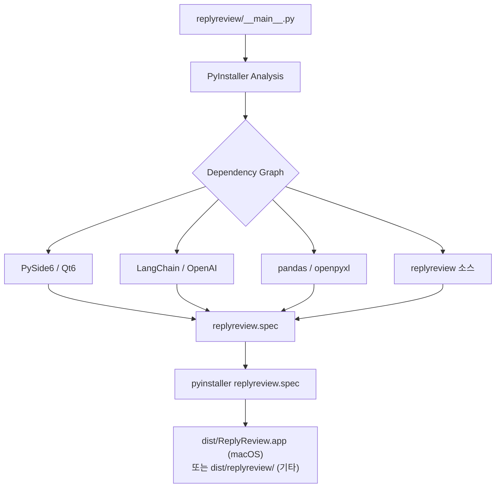

# Specification: 독립 실행 파일 패키징 및 배포 체계 확립

## Overview

이 트랙은 ReplyReview 데스크톱 애플리케이션을 일반 사용자가 별도의 Python 환경 설정 없이 즉시 실행할 수 있는 독립 실행 파일로 패키징하는 배포 인프라를 구축합니다.

PyInstaller를 사용하여 Python 인터프리터, PySide6, LangChain, pandas 등 모든 의존성을 번들링한 단일 디렉토리 형태의 실행 파일을 생성하고, `.spec` 파일 기반의 재현 가능한 빌드 체계를 확립합니다.

이 트랙이 완료되면 `dist/` 디렉토리에 사용자가 즉시 실행 가능한 앱 결과물이 생성되며, 빌드 명령 하나로 동일한 결과를 재현할 수 있는 상태가 됩니다.

## Requirements

### 1. 실행 파일 빌드 시스템

- `replyreview/__main__.py`를 엔트리포인트로 하여 PyInstaller가 의존성을 자동 분석·번들링한다.
- 빌드 결과물은 단일 디렉토리(`--onedir`) 형태로 생성한다.
  - `--onefile`은 실행 시 압축 해제 오버헤드와 PySide6 Qt 플러그인 로딩 문제가 발생할 수 있으므로 사용하지 않는다.
- 콘솔 창이 표시되지 않도록 `--windowed` 옵션을 적용한다.
- 빌드 설정은 `replyreview.spec` 파일로 관리하여 옵션을 코드로 추적하고 재현 가능하게 한다.
- `tests/` 경로의 개발 전용 코드(`FakeAIClient` 등)는 빌드 결과물에서 제외한다.

### 2. 배포 설정 최적화

- 애플리케이션 고유 아이콘 파일을 `assets/` 디렉토리에 준비하고 빌드에 적용한다.
  - macOS: `assets/icon.icns`
  - Windows: `assets/icon.ico`
- macOS에서는 `.app` 번들 형태(`BUNDLE` 섹션)로 빌드하여 Dock 아이콘 및 Finder 통합을 지원한다.
- 빌드 명령을 `build.sh` 스크립트로 래핑하여 일관된 빌드를 보장한다.
- `docs/tech-spec.md` 5절의 빌드 전략을 구현 기준으로 준수한다.

## Build Strategy



PyInstaller가 엔트리포인트를 기점으로 import 그래프를 정적 분석하여 필요한 모든 모듈과 바이너리를 `dist/` 디렉토리에 번들링합니다. `replyreview.spec` 파일은 이 과정의 설정을 선언적으로 관리합니다.

## Directory Structure

트랙 완료 후 생성 또는 수정되는 파일 목록입니다.

```text
replyreview/
├── assets/
│   ├── icon.icns                  # 기존: macOS용 앱 아이콘
│   └── icon.ico                   # 기존: Windows용 앱 아이콘
├── replyreview.spec               # 신규: PyInstaller 빌드 명세 파일
├── build.sh                       # 신규: macOS/Linux 빌드 실행 스크립트
├── build.bat                      # 신규: Windows 빌드 실행 스크립트
└── docs/
    └── tech-spec.md               # 수정: 5절 빌드 전략 구현 세부사항 반영
```

## Acceptance Criteria

- [ ] `sh build.sh` 실행 시 오류 없이 빌드가 완료된다.
- [ ] macOS에서 `dist/ReplyReview.app` 번들이 생성된다.
- [ ] 빌드된 앱 실행 시 콘솔 창이 표시되지 않는다.
- [ ] 빌드된 앱 실행 시 애플리케이션 아이콘이 표시된다.
- [ ] 빌드된 앱에서 CSV 파일 로드 및 AI 답글 생성 기능이 정상 동작한다.
- [ ] `replyreview.spec` 파일이 프로젝트 루트에 커밋되어 재현 가능한 빌드가 가능하다.
